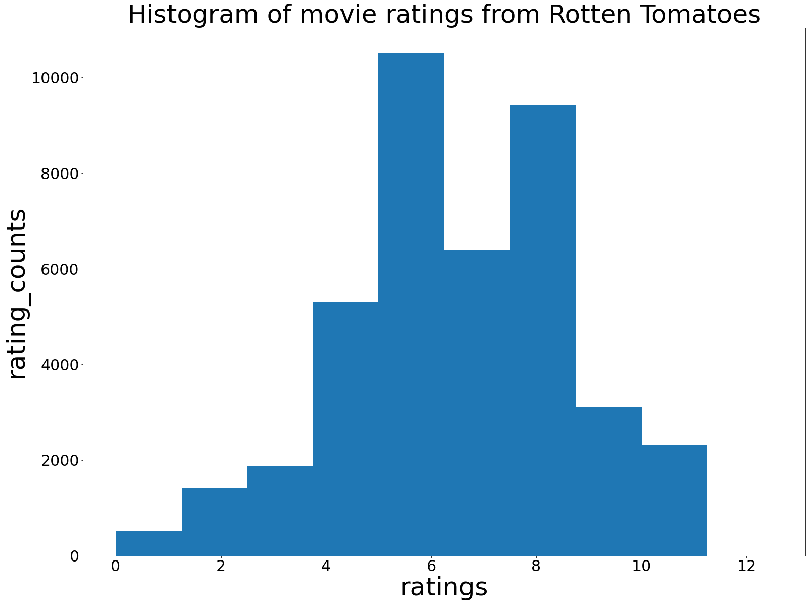
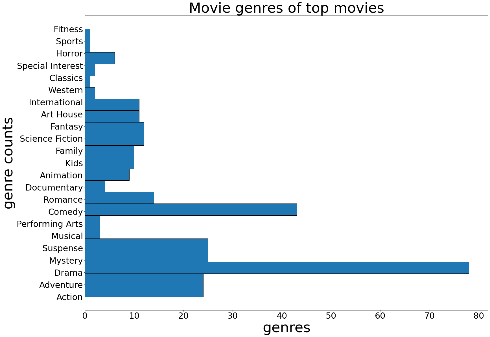

# Microsoft Movie Data Analysis
### Author: Keith Maina

## Overview
In this project we are going to be examining film data from various sources on the internet such as IMDB, Rotten Tomatoes among others to determine what the next course of action for the newly founded Microsoft film studio should be. We specifically want to provide insight into the kind of films, they should make.

## Business Problem
We want to know what kind of movie Microsoft movie studios should make by determining the most popular kind of movies.

### Business Questions
What is the movie with the most reviews?  
What are the movies with the most positive reviews and what are their genres?  
What are the top 5 movie genres by popularity?  
What are the movies with the most money made and what are their genres?  

## Data
In this project we are using:
- Data on the budgets and grossing of movies from The Numbers movie dataset.
- Data on movie-critic-reviews from the Rotten Tomatoes movie dataset.

## Methods
For my analysis, I chose to ignore missing values because it would be safer to do so. Assuming values presents the danger of working with completely wrong values and hence making false conclusions.

For the Rotten Tomatoes dataset, I had the dataframes, Movie-info and review-data. I standardized the rating values by making them be in a scale of 1-10 because they were not in the same format (some were on a scale of 1-5, others alphabetical)

I then performed an inner join on movie-info and review-data, so that i could be able to access the synopsis of the movies which sometimes contained the name of the movie of a particular record.

I then aggregated the values by 'movie'(by movie i mean synopsis because there was no movie_name column) and got the mean of each movie's rating from the multitude of critics who reviewed it.

I then sorted the resulting dataframe by the mean acquired.

For the top genres by popularity, i took the first 40% of the dataframe described aboce and performed a value count of the genres.

For the monetay analysis i just converted the monetary columns of the movie_budgets dataframe into integers and performed a column subtraction between the money grossed and the budget of the movie.

## Conclusions

The most popular movies amongst the general audience seems to be science fiction and action. While the most popular movies among movie critics seem to be Drama and Comedy. So i recommend Microsoft studios to:
- Create a movie that has all 4 of the above mentioned genres: action, scifi, drama, comedy (the movie deadpool comes to mind)
- Stay away from Sports and Fitness genres. 
I have also concluded that the top movies have multiple sequels. So i suggest Microsoft studios to:
- to put  some of their resources aside for a future sequel.

